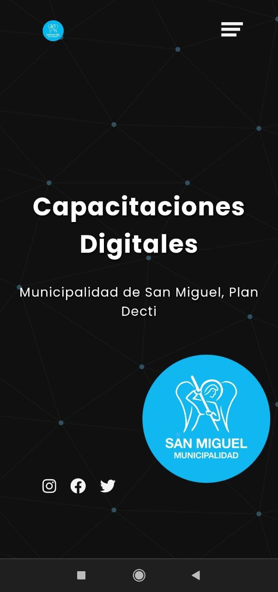

### Pablo Paez 💻
# Capacitaciones Digitales - Municipalidad San Miguel
# Live Test!
https://san-miguel-capacitaciones-pablo.vercel.app/

### Contacto

Pablo Paez - Desarrollador Web - pablopaez2307@gmail.com

[![LinkedIn][linkedin-shield]][linkedin-url]


<br />
<div align="center">

  <a href="https://github.com/Pepe2307/WebTrabajo">
    
  </a>

  <h3 align="center">San Miguel / Buenos Aires / Argentina</h3>
</div>


## El proyecto

Este proyecto se originó debido a que en las clases que dicto sobre diversas areas de la informatica (Programacion, Robotica, Impresion 3D etc) existen distintas presentaciones PDF para cada clase/materia por lo cual se me ocurrio solucionar esto poniendo toda la informacion necesaria en un solo lugar con un poco de estilo e informacion extra sobre el trabjo

### Tecnologias utilizadas

Este proyecto utiliza como herramienta principal: 
[![React][React.js]][React-url]

Ademas de React, se utilizaron conocimientos en HTML,CSS,Bootstrap,JSon,GitKraken,Vercel Hosting

<br/>


[![Product Name Screen Shot][product-screenshot]](https://san-miguel-capacitaciones-pablo.vercel.app/)
<div align="center">
  <h3 align="center">(Click en la imagen para ir a la pagina)</h3>
</div>

<br/>


## Version Mobile:


<div align="center">

  <a href="https://github.com/Pepe2307/WebTrabajo">
    
    
  </a>
</div>


## Instalacion

### Requisitos previos

Se recomienda tener la ultima version de npm para evitar errores:

  ```sh
  npm install npm@latest -g
  ```
* Gitbash/GitKraken o su software de preferencia y Visual Studio Code

### Clonar repositorio


1. Clonar el repositorio
   ```sh
   git clone https://github.com/Pepe2307/WebTrabajo
   ```
   
2. Instalar paquetes NPM
Abrir dentro de Visual Studio Code la carpeta del repositorio clonado > darle click derecho a la misma > Abrir en terminal
   ```sh
   npm install
   ```
   
3. Inicializar proyecto

   ```js
   npm start
   ```


<!-- LINKS -->

[linkedin-shield]: https://img.shields.io/badge/-LinkedIn-black.svg?style=for-the-badge&logo=linkedin&colorB=555
[linkedin-url]: https://www.linkedin.com/in/pablo-paez-t/
[product-screenshot]: src/images/screenshot1.jpg
[React.js]: https://img.shields.io/badge/React-20232A?style=for-the-badge&logo=react&logoColor=61DAFB
[React-url]: https://reactjs.org/
